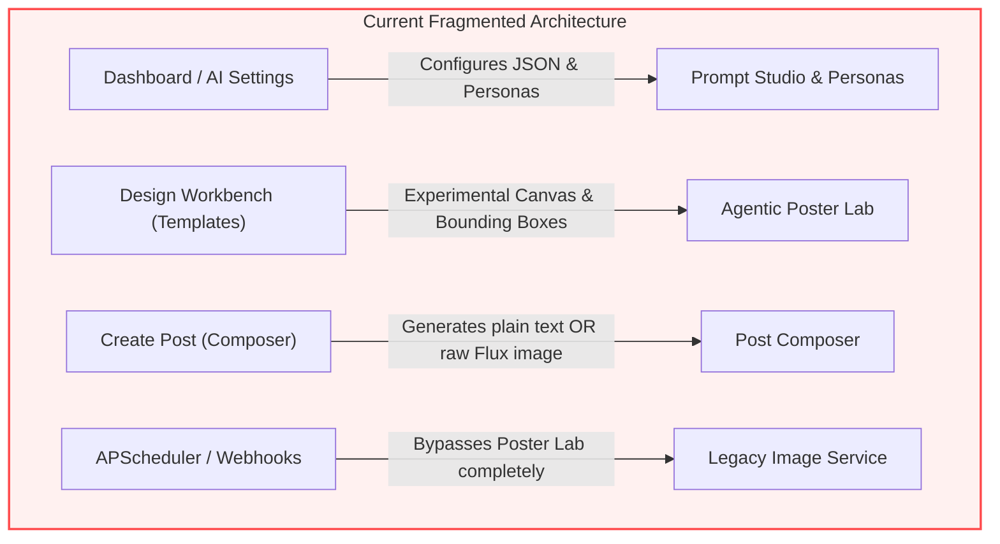
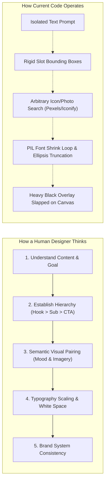
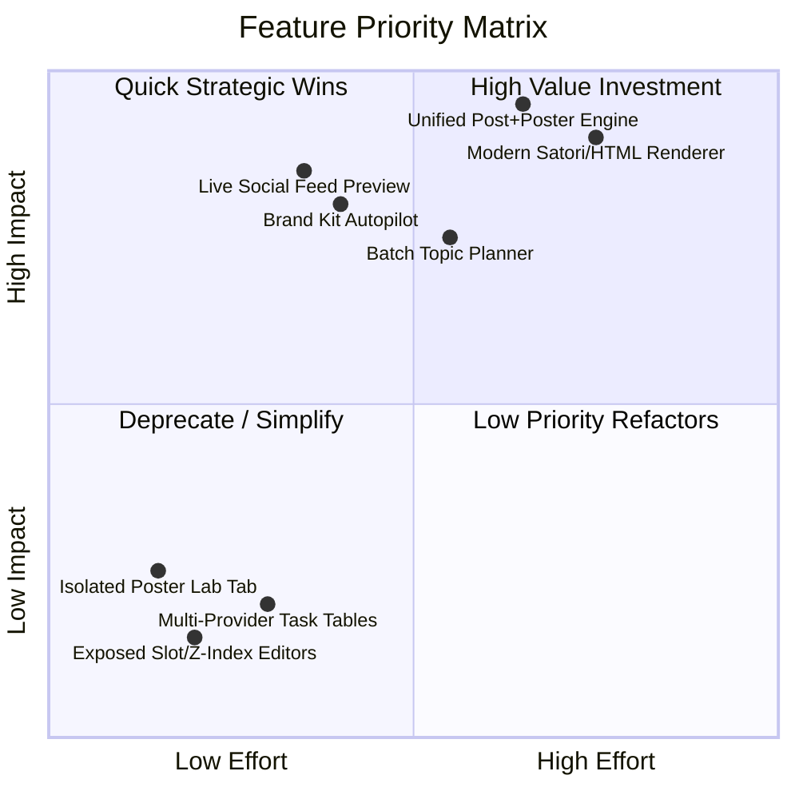
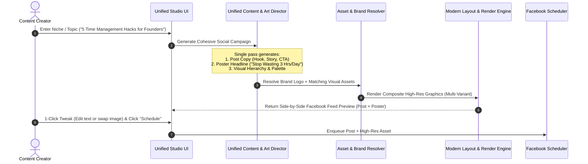

# Comprehensive Architectural, Design & Product Audit: Aligning AutoPoster with its Core Inspiration

---

## 1. Executive Summary & The Core Dilemma

The primary inspiration and promise of **AutoPoster** is:
> **"A Facebook page owner enters their niche, topic, or high-level prompt, and the AI autonomously crafts a complete, high-converting Facebook post (compelling caption, hooks, emojis, hashtags, CTA) paired with a matching, on-brand graphic poster — ready for 1-click preview, refinement, scheduling, and publication."**

### The Current Reality
The codebase today is a collection of **powerful but siloed developer experiments** that do not talk to each other:



1. **In Composer (`composer-view.tsx`)**: The user clicks *"Generate with AI"* for text, then separately clicks *"Generate image with AI"* (which calls raw Flux/Stability for an image with **no text, no layout, no branding**), or chooses a legacy template. The modern **Art Director / Poster Lab** pipeline is completely detached.
2. **In Agentic Poster Lab (`AgenticPosterLab.tsx`)**: The user enters a topic and generates a visual canvas, but **no Facebook post copy is generated**, no persona tone is applied, and the user must manually click a button to push an image string via `sessionStorage` into the Composer.
3. **In Prompt Studio & AI Settings (`ai-settings-view.tsx`)**: The user is confronted with raw regex prompts, layer JSON configs, multi-provider model routing tables, and complex scheduling rules rather than a unified content creation flow.
4. **In the Background Scheduler (`publish_image_service.py`)**: Automatic publishing **bypasses the Art Director pipeline entirely** ([`POSTER_SYSTEM.md:L35`](file:///d:/my%20projects/my%20research/auto_poster_agentic_ai/POSTER_SYSTEM.md#L35)), falling back to raw provider generations or legacy prompt layers.

---

## 2. Graphic Design Principles: How a Professional Art Director Thinks vs. Current System Limitations

If an experienced human visual designer/art director was tasked with creating social media posts and posters for a brand, here is their mental model compared to how the current code operates:



### Key Design Deficits in Current System:

| Design Dimension | How a Professional Designer Thinks | How the Current Code Works | Why the Output Fails |
| :--- | :--- | :--- | :--- |
| **Content-Visual Synergy** | The poster graphic is **not** a repetition of the post; it is a **visual hook** (e.g., Post = Story + Advice; Poster = "3 MISTAKES TO AVOID"). | Post text and Poster text are generated in separate prompts with no shared conversational context. | The graphic either repeats the full caption or displays disconnected, generic headlines. |
| **Visual Hierarchy & Focal Point** | 1 primary focal point (dominant headline or hero illustration), 1 secondary anchor, ample breathing room (negative space). | The Art Director assigns elements to rigid template slots (`headline`, `subheadline`, `main_icon`, `badge`). | LLM tends to fill every slot, creating cluttered, busy, amateurish compositions. |
| **Typography & Text Fitting** | Dynamic typography with proportional scale (1.25/1.33 modular scale), optical kerning, custom leading, and responsive wrapping. | Pillow (PIL) font shrink loops (`composition_validator.py`) shrink text until it fits, or truncates with `...`. | Text either becomes unreadably tiny (12pt floor) or gets awkwardly cut off midway through a keyword. |
| **Color & Contrast** | Harmonious color palettes (60-30-10 rule), atmospheric lighting, tinting, and gradient masks for legibility. | If contrast fails, the validator increments a solid black overlay opacity up to `0.85` ([`POSTER_SYSTEM.md:L70`](file:///d:/my%20projects/my%20research/auto_poster_agentic_ai/POSTER_SYSTEM.md#L70)). | Background photos are dimmed into murky grey/black mud, destroying the photographic impact. |
| **Rendering Engine** | Modern CSS layouts (Flexbox, CSS Grid, SVG paths, Gaussian blurs, `backdrop-filter`, gradient text). | Pure 1990s raster graphics with Python Pillow (`poster_renderer.py` / `prompt_studio_renderer.py`). | Output looks flat, boxy, and lacks modern aesthetic gloss (drop shadows, blur glass, rich typography). |

---

## 3. Deep-Dive Codebase Audit: Missing vs. Overwhelming Features

### 3.1 What Features are ABSENT (Crucial Needs)



1. **Unified "Campaign & Post Studio" (Single-Click Generation)**:
   - *Current Gap*: The user must navigate to **AI Settings** to configure a persona, go to **Templates/Poster Lab** to make a graphic, and go to **Composer** to write a post and schedule it.
   - *Need*: A single input: *"Give me a post about [Topic / Niche]"* $\rightarrow$ System generates:
     1. **Optimized Facebook Post Copy** (Hook, Value Body, CTA, Hashtags).
     2. **Matched On-Brand Poster Graphic** (Headline, Sub-hook, Icon/Graphic, Brand Logo).
     3. **Interactive Side-by-Side Facebook Feed Mockup** with 1-click publish/schedule.

2. **Semantic Post-to-Poster Content Bridge**:
   - *Current Gap*: [`art_director.py`](file:///d:/my%20projects/my%20research/auto_poster_agentic_ai/backend/app/services/art_director.py#L79) only receives a `topic: str` without knowledge of the generated caption, persona voice, or target audience.
   - *Need*: A unified schema where the LLM plans the **campaign angle**, writes the **post copy**, and extracts the **poster headline/visual prompt** in a single synchronized cognitive pass.

3. **Brand Kit Autopilot**:
   - *Current Gap*: Brand colors and fonts are fragmented across `palettes.json`, `font-pairs.json`, and manual settings dropdowns.
   - *Need*: An automated Brand Kit where a user uploads their logo once, selects their primary brand color + tone, and every generated post/poster automatically incorporates the logo badge and color hierarchy.

4. **Modern Declarative Renderer (Satori / HTML-CSS Compositor)**:
   - *Current Gap*: Python Pillow (`PIL`) cannot handle responsive wrapping, nested flex containers, or modern web typography effects.
   - *Need*: HTML/CSS-based layout engine (like Satori or Puppeteer) to allow modern typography, responsive badges, and clean design components.

---

### 3.2 What Features are OVERWHELMING / UNNECESSARY (Fat to Trim)

1. **Exposing Low-Level Slot Names, Coordinates & Z-Indices to End-Users**:
   - Users creating Facebook content do not want to manage `slot: "corner_badge"`, `z_index: 3`, or `x: 120, y: 450`. The direct-manipulation Konva canvas should feel like Canva, not a database debugger.
2. **Duplicated / Fragmented Image Engines**:
   - Currently, there are **3 distinct image generation pipelines** in the codebase:
     - Pipeline A: `poster_orchestrator.py` (Art Director + Resolver + PIL + Vision Critic).
     - Pipeline B: `prompt_studio_renderer.py` / `persona_image_templates.py` (Old layered template system).
     - Pipeline C: `publish_image_service.py` $\rightarrow$ raw provider text-to-image (FLUX / Stability).
   - This causes maintenance nightmares, inconsistent visual quality, and user confusion.
3. **Over-Engineered Multi-Provider Task Tables**:
   - The user is asked to configure separate LLM and image providers for `post_generation`, `post_analysis`, `image_prompt_generation`, `style_analysis`, and `recommendations` ([`autoposter_system_architecture.md:L116`](file:///d:/my%20projects/my%20research/auto_poster_agentic_ai/autoposter_system_architecture.md#L116)). For a social media creator, this is massive cognitive overhead.

---

## 4. Master Phased Implementation Plan



---

### Phase 1: Unified Campaign & Post Generation Engine (Backend) ✅ [COMPLETED]
> **Goal:** Create a single, cohesive backend pipeline where giving a topic/niche generates BOTH the Facebook post copy and the graphic poster structure in a unified cognitive pass.

- [x] **Phase 1.1: Unified Campaign Service (`app/services/campaign_generator.py`)**
  - Implement a single LLM orchestration pass that accepts: `page_id`, `topic_or_niche`, `persona_id`, and `brand_kit`.
  - Structured output schema:
    ```python
    class UnifiedCampaignResponse(BaseModel):
        campaign_theme: str
        post_content: str  # Optimized hook, value bullets, call-to-action
        hashtags: list[str]
        graphic_concept: {
            "headline": str,      # Punchy 3-5 word visual hook
            "subheadline": str,   # Supporting statistic or subtitle
            "badge_text": str,    # e.g. "NEW GUIDE", "PRO TIP"
            "suggested_mood": str,
            "visual_asset_query": str
        }
        poster_variants: list[ArtDirectorOutput]  # 2-3 design variations
    ```
- [x] **Phase 1.2: Unified Campaign Endpoint (`app/routers/campaign.py`)**
  - Expose `POST /api/campaign/generate-unified`.
  - Wire directly into `poster_orchestrator.py` to auto-resolve assets and render visual candidates immediately.
- [x] **Phase 1.3: Bridge Background Scheduler (`publish_image_service.py`)**
  - Update `maybe_generate_image_for_post()` to call the unified Art Director pipeline instead of falling back to raw Flux/Stability or legacy prompt studio.

---

### Phase 2: Consolidated Creator Studio UI (Frontend) ✅ [COMPLETED]
> **Goal:** Eliminate tab jumping. The user stays on a single screen with an intuitive, unified creation and preview experience.

- [x] **Phase 2.1: Unified Creator Studio Component (`composer-view.tsx`)**
  - Replace the separate "Generate text" vs "Generate image" buttons with a single **"Generate Full Post & Poster"** action.
  - Input field accepts: Topic, Niche, or Goal (e.g., *"Tips for real estate buyers in 2026"*).
- [x] **Phase 2.2: Live Side-by-Side Facebook Feed Mockup**
  - Left Panel: Post text editor with live character counter, hashtag chips, and CTA toggles.
  - Center/Right Panel: Interactive Facebook Post Mockup showing the page profile picture, page name, timestamp, post caption, and rendered graphic poster.
  - Direct Variant Switcher: Toggle between 3 generated graphic styles directly inside the feed mockup.
- [x] **Phase 2.3: Seamless 1-Click Fine-Tuning**
  - Click any text element on the graphic in the mockup to edit it directly.
  - 1-click asset swap bar (Pexels / Iconify candidates) integrated right under the graphic preview.
  - Single **"Publish to Facebook Now"** or **"Schedule for Best Time"** button.

---

### Phase 3: Brand Kit & Persona Simplification ✅ [COMPLETED]
> **Goal:** Transform complex AI settings and JSON templates into an effortless 1-click Brand Identity system.

- [x] **Phase 3.1: Simplified Brand Kit Profile (`models.BrandProfile` / `brand_automation.py`)**
  - Store Page Logo URL, Primary Color, Secondary Color, Font Preference, and Niche Description.
  - Auto-extract brand colors when a user connects their Facebook page or uploads a logo.
- [x] **Phase 3.2: Persona Onboarding Wizard**
  - Streamline Persona setup into 3 simple fields: **Niche**, **Tone of Voice** (e.g., Casual, Authoritative, Inspiring), and **Audience Goal**.
  - Remove raw prompt templates, regex configs, and exposed token settings from the standard user view (relegate to Advanced Developer Drawer).

---

### Phase 4: Layout & Rendering Modernization ✅ [COMPLETED]
> **Goal:** Overcome Python Pillow layout limitations and achieve Canva-grade aesthetic polish.

- [x] **Phase 4.1: Modern Design System Templates (`templates.json` / `layouts.json`)**
  - Introduce editorial typography templates with intentional asymmetry, quote-card styles, stat-callout styles, and modern minimal layouts.
  - Implement dynamic color-harmony contrast (changing text color and pill badges instead of slapping opaque black overlays).
- [x] **Phase 4.2: Modern Graphic Layer Engine (`poster_renderer.py` / `composition_validator.py`)**
  - Support gradient overlays, glassmorphism badges, dynamic contrast drop shadows, and automatic word-wrapping text without PIL shrink loops.

---

### Phase 5: Batch Content Campaign Planner (Niche-to-Calendar) ✅ [COMPLETED]
> **Goal:** Fulfill the complete vision where a user gives their niche and gets a full week/month of cohesive, non-repetitive content scheduled in seconds.

- [x] **Phase 5.1: Niche-Based Daily Theme Mapping**
  - Input: User niche (e.g., "Movies" or "Science").
  - Output: The LLM automatically plans a diverse weekly schedule with recurring daily themes (e.g., Monday: Case Study / Review, Tuesday: Tactical How-To, Wednesday: Quote / Mindset, Friday: Framework Checklist). This ensures posts are unique every day and highly engaging.
- [x] **Phase 5.2: Multi-Day Campaign Generator (`POST /api/campaign/generate-batch`, `POST /api/campaign/schedule-batch`)**
  - Automatically generate the full week of content based on the planned themes, outputting complete copy + branded posters for each slot.
- [x] **Phase 5.3: 1-Click Content Calendar Approval UI (`scheduled-slots-view.tsx`)**
  - Visual grid of the generated posts.
  - User can approve all with a single click or drag-and-drop to adjust scheduling times.

---

### Phase 6: Custom Theme Engines & Meme Generators (Scenario-Based Content) ✅ [COMPLETED]
> **Goal:** Allow users to build highly specific, recurring content engines like meme generators or educational science posters using their own curated asset libraries.

- [x] **Phase 6.1: Custom Theme & Asset Library Manager (`models.CustomTheme`, `models.ThemeAsset`, `routers/meme.py`)**
  - Users can create a specific "Theme" (e.g., "Cat Memes" or "Science Facts").
  - Users can upload a custom library of base images and link them to this theme.
  - Users define the layout/template style for this theme (e.g., meme text layout vs. headline card layout).
- [x] **Phase 6.2: The Daily Meme / Scenario Engine (`services/meme_generator.py`, `services/meme_renderer.py`)**
  - The scheduler selects the theme for the day.
  - The system picks a random/unused base photo from the user's custom library.
  - The LLM generates fresh, humorous text tailored to that specific image and applies it to the interactive poster.
- [x] **Phase 6.3: Interactive & Educational Posters & Meme Studio UI (`meme-studio-view.tsx`, `/dashboard/memes`)**
  - Viral Meme Studio view with 1-click generation, format switching, live preview text tuning, and direct Facebook publishing.

---

## 5. Execution Summary Table

| Phase | Core Objective | Key Deliverable | Status |
| :--- | :--- | :--- | :---: |
| **Phase 1** | Unified Campaign Pipeline | Backend endpoint generating Post Copy + Graphic in 1 pass | ✅ Completed |
| **Phase 2** | Consolidated Creator Studio UI | 1-screen Live Facebook Feed Mockup + Poster switcher | ✅ Completed |
| **Phase 3** | Brand Kit & Persona Autopilot | 1-click brand kit with automatic logo/color styling | ✅ Completed |
| **Phase 4** | Layout & Aesthetic Engine | Color-harmony contrast + modern editorial templates | ✅ Completed |
| **Phase 5** | Batch Niche Planner | Niche-to-Calendar mapping with daily themes & batch generation | ✅ Completed |
| **Phase 6** | Custom Theme & Meme Engines | Meme generators, custom asset libraries, and viral studio | ✅ Completed |
| **Fonts** | Custom Typography Manager | 1-click Google Font downloader, custom `.ttf`/`.otf` file uploader | ✅ Completed |