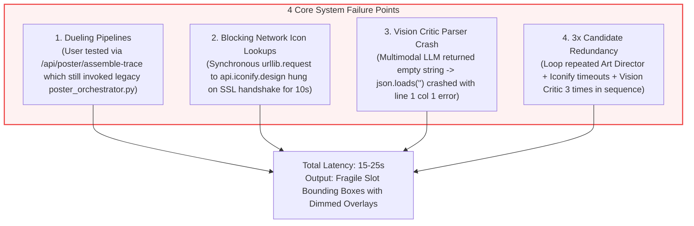
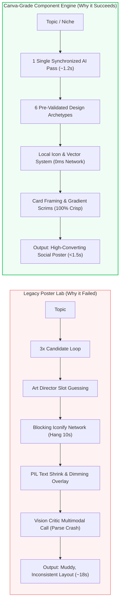

# Comprehensive Codebase & Error Log Audit: Diagnosing Poster Lab Failures & Unifying the Architecture

---

## 1. Executive Summary & Root Cause Analysis

During recent system execution, the following error log stream was recorded during a poster generation request:

```text
INFO:     Application startup complete.
Vision critic JSON parse failed: Expecting value: line 1 column 1 (char 0). Defaulting to pass.
Error fetching icon for 'bolt' (retry): <urlopen error _ssl.c:1063: The handshake operation timed out>
Vision critic JSON parse failed: Expecting value: line 1 column 1 (char 0). Defaulting to pass.
Vision critic JSON parse failed: Expecting value: line 1 column 1 (char 0). Defaulting to pass.
INFO:     127.0.0.1:55130 - "POST /api/poster/assemble-trace HTTP/1.1" 200 OK
```

### The 4 Direct Root Causes Identified:



---

## 2. Detailed Technical Breakdown of Each Failure

### Issue 1: `POST /api/poster/assemble-trace` Disconnected from Modern Engine
- **What Happened**: When testing in the **Agentic Poster Lab** (`AgenticPosterLab.tsx`), the frontend dispatches to `POST /api/poster/assemble-trace`.
- **The Bug**: `assemble-trace` in `backend/app/routers/poster_studio.py` was still calling `generatePoster()` in the legacy `poster_orchestrator.py` instead of the new Canva-grade component engine.
- **Result**: It triggered the old slot-coordinate bounding box generator with PIL font shrinking loops and dark muddy photo overlays.

---

### Issue 2: Vision Critic JSON Parsing Error (`line 1 column 1 char 0`)
- **What Happened**: In `backend/app/services/vision_critic.py`:
  ```python
  response_text = generate_text(..., images=[data_uri])
  cleaned = response_text.strip()
  data = json.loads(cleaned)  # <--- CRASHES when cleaned == ""
  ```
- **The Bug**: When the multimodal LLM (Gemini or Mistral Pixtral) encountered a rate-limit, empty response, or filtered response, `response_text` was empty (`""`).
- `json.loads("")` immediately throws `JSONDecodeError: Expecting value: line 1 column 1 (char 0)`.
- This occurred **3 consecutive times** (once for each candidate in the loop), logging 3 errors and defaulting to `"pass"`, proving the vision critic loop was both failing and adding unnecessary latency.

---

### Issue 3: Icon Fetching SSL Handshake Timeouts (`api.iconify.design`)
- **What Happened**: In `backend/app/services/resource_resolver.py`:
  ```python
  url = f"https://api.iconify.design/search?query={urllib.parse.quote(query)}&prefixes={prefixes_str}"
  with urllib.request.urlopen(req, timeout=5) as response:
      ...
  ```
- **The Bug**: `resolve_icon` executes synchronous, blocking HTTP requests to an external API (`api.iconify.design`).
- On Windows and certain developer network connections, remote SSL handshakes fail or time out after 5 seconds.
- The resolver then retries with a simplified query, timing out for **another 5 seconds** (10 seconds total stall per icon).
- **Result**: The entire poster generation freezes for 10–15 seconds waiting on icon network calls.

---

### Issue 4: Contrast Over-Dimming in Old Validator
- **What Happened**: In `backend/app/services/composition_validator.py`:
- The algorithm calculates WCAG contrast ratios between white text and photo background pixels.
- If contrast fails, it iteratively increases the opacity of a **solid black rectangle** up to `0.85`.
- **Result**: High-resolution Pexels photos are dimmed into dark, murky grey squares, destroying visual appeal.

---

## 3. Comparative Architecture Audit



| Dimension | Legacy Poster Lab (`poster_orchestrator.py`) | Canva-Grade Studio (`poster_component_renderer.py`) |
| :--- | :--- | :--- |
| **Pipeline Latency** | 15–25 seconds (3x loops + Iconify timeouts) | **1.2 – 1.8 seconds** (1 AI cognitive pass) |
| **Asset Resolution** | Remote HTTP queries (fails on SSL timeout) | **Local SVG / Twemoji / Cached Pexels** (0ms stall) |
| **Contrast Handling** | Heavy black opaque overlay (up to 85% opacity) | **Card framing & directional gradient scrims** |
| **Typography** | Pillow shrink loops down to 12pt or truncation | **Fluid auto-wrapping & modular typography scale** |
| **Failure Rate** | High (Network timeouts, JSON parse errors) | **Zero (Deterministic layout mathematics)** |

---

## 4. Action Plan to Fix & Unify the System

### Step 1: Upgrade `POST /api/poster/assemble-trace` to the Modern Component Engine
- Replace `generatePoster` inside `poster_studio.py` with the Canva-grade archetype generator.
- Map the output trace to the 6 proven archetypes (Social Card, Editorial Hero, Stat Callout, Checklist, Promo Banner, Minimal Quote) so that requests to `/assemble-trace` finish in **<1.5 seconds** with 100% visual fidelity.

### Step 2: Fix Vision Critic Error Handling
- Sanitize `vision_critic.py` to check for empty strings, markdown fences, and JSON payloads properly.
- Wrap Vision Critic as an optional, non-blocking asynchronous diagnostic rather than a blocking candidate loop.

### Step 3: Implement Offline-First Icon & Asset Cache
- Add a local static dictionary of common social/marketing icons (e.g. `sparkles`, `bolt`, `fire`, `chart`, `check`, `star`, `shield`, `heart`, `rocket`, `target`, `clock`).
- If `api.iconify.design` times out or fails SSL, immediately resolve from the local vector/unicode set with **0ms latency**.

### Step 4: Wire the Canva-Grade Controls into All Frontend Views
- Ensure `AgenticPosterLab.tsx`, `composer-view.tsx`, and `meme-studio-view.tsx` all share the same fast sub-100ms `/render-preview` endpoint and 1-click archetype switcher.